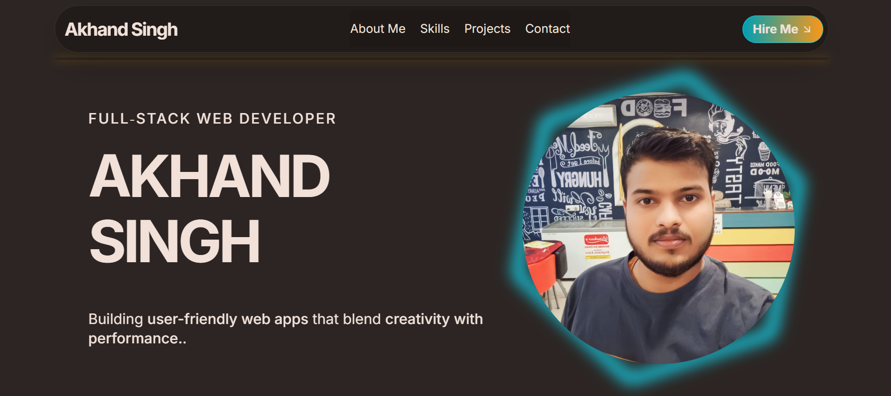

# 🌟 Akhand Singh — Portfolio Website

Welcome to my personal portfolio website! This site showcases my work, skills, and passion for building elegant, scalable, and user-friendly web applications.

## 🚀 Live Demo  
👉 [View Portfolio](https://your-portfolio-link.com)  


#  Screenshots
   

---

## 📌 Features

- ⚡ **Fast and Responsive Design** — Optimized for all devices (mobile, tablet, desktop)  
- 🎨 **Modern UI** — Built with Tailwind CSS for clean, stylish visuals  
- 🖥️ **Dark/Light Mode Ready** (if applicable)  
- 🌱 **Accessible and SEO-Friendly**  
- 🛠️ **Built with React + Vite + Tailwind CSS**  
- 💬 **Smooth animations** with Framer Motion  
- 🧩 **Reusable and modular components**

---

## 🛠 Tech Stack

| Technology | Description                       |
|------------|------------------------------------|
| ⚛️ React   | Front-end framework                |
| ⚡ Vite    | Blazing fast build tool            |
| 🌬 Tailwind CSS | Utility-first CSS framework |
| 🎞 Framer Motion | Animations                  |
| 🔗 Deployed on | (Vercel / Netlify / GitHub Pages) |

---

## 📁 Project Structure

```
src/
├── components/ # Reusable React components
├── pages/ # Page components (if applicable)
├── assets/ # Images, icons
├── styles/ # Custom CSS (if any)
├── App.jsx # Main app component
└── main.jsx # Entry point
```


---

## 📝 How to Run Locally

```
# Clone the repository
git clone https://github.com/AKHANDSINGH1911/portfolio-website.git

# Go into the directory
cd portfolio-website

# Install dependencies
npm install

# Start the development server
npm run dev

```

# 🙌 Acknowledgements / Inspiration

Tailwind CSS

Framer Motion

Vite

Inspired by modern developer portfolio designs across the web

# ✉️ Contact
If you'd like to collaborate, provide feedback, or just connect:

📧 Email: akhandsingh706@gmail.com

💼 LinkedIn: https://www.linkedin.com/in/akhand-singh-a81a86259/

💻 GitHub: AKHANDSINGH1911

